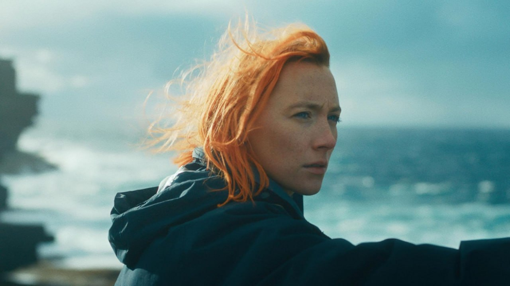

“Девушка после лечения алкоголизма возвращается домой в провинциальную Шотландию. Воспоминания о детстве сливаются с недавними тяжёлыми событиями, которые привели её на путь выздоровления от зависимости.”

Экранизация автобиографии писательницы Эми Липтрот.

Зависимость - побег от мира внутри него же. Побег от зависимости только на край этого мира. Оркнейские острова в Шотландии идеально подходят на эту роль.

Сирша Ронан - великолепная актриса, за игрой которой наблюдать одно удовольствие. Думаю самой важной и сложной частью было показать тяжесть по(пыток) выйти из зависимости. Режиссёр не справилась с этой задачей, как говорят некоторые. Однако, не думаю, что у неё была цель в этом смысле передать книгу. Фильм не про победу над зависимостью, а про обретение себя через выход с самого дна. Про погружение в себя и попытке отыскать, кто ты есть на самом деле. По хорошему, нам всем нужен такой побег на острова. 

Фильм обнажает одну простую истину - по большому счету никому не интересны твои проблемы. У всех вокруг хватает своих. Тебе придется разбираться самому. У людей нет энергии, чтобы вытаскивать тебя. У них едва ее хватает на себя. 

Здесь Лондон (как и любой другой мегаполис) поглощает героиню Ронан без остатка, вымывая и вымарывая идентичность, подчиняет своему ритму. Города ломают, навязывают бесполезную стремительную жизнь с религиозной иллюзорностью достижения богатства. Ты не можешь контролировать мир, который на тебя набрасывается.

Весь фильм героиня тотальна одинока. Намеренно закрыта от всех. И даже от природы музыкой. И только в этой кромешной тишине, обретая себя, есть  возможность, после, обрести других.

Почти безжизненные и такие живые пейзажи Оркнейских островов, заключённые в суровые объятия атлантического океана, будто иллюстрируют противоречивость внутреннего состояния главной героини.

Сирша филигранно играет эту внутреннюю борьбу с тихим плачем и растерянным взглядом в даль в попытке освобождения от зависимости. 

Фильм о природе и человеке. О вечном и таком хрупком существовании одной маленькой жизни.

Конечно, теперь хочется прочитать книгу.